# LINE で OpenAI 社の API と連携するチャットボットを作ってみた (ChatGPT)

## 構成とやりとりの流れ

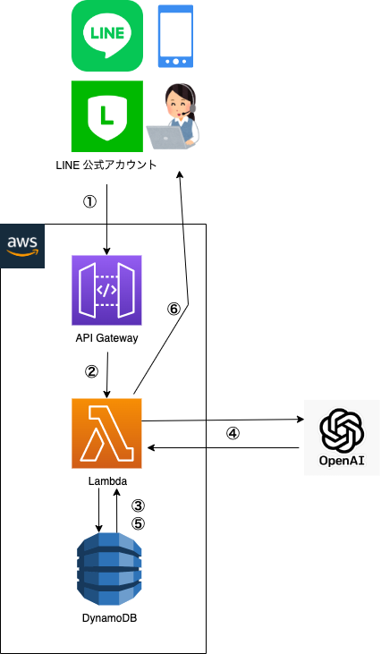

1. LINE 公式アカウントの `MessagingAPI` を用いて AWS の `API Gateway` に紐付いている URL に Webhook イベントを送信する
2. AWS `Lambda` に連携
3. AWS `DynamoDB` に会話を保存 + 過去の会話履歴を新しい方から適当な分だけ取得
4. OpenAI 社の API を叩いて返答を得る
5. AWS `DynamoDB` に返答を保存
6. `MessagingAPI` の `Reply API` を叩いて返事を LINE に送信

## 1. MessagingAPI で Webhook イベント送信 -> 2. Lambda に連携

LINE 公式アカウントを作る
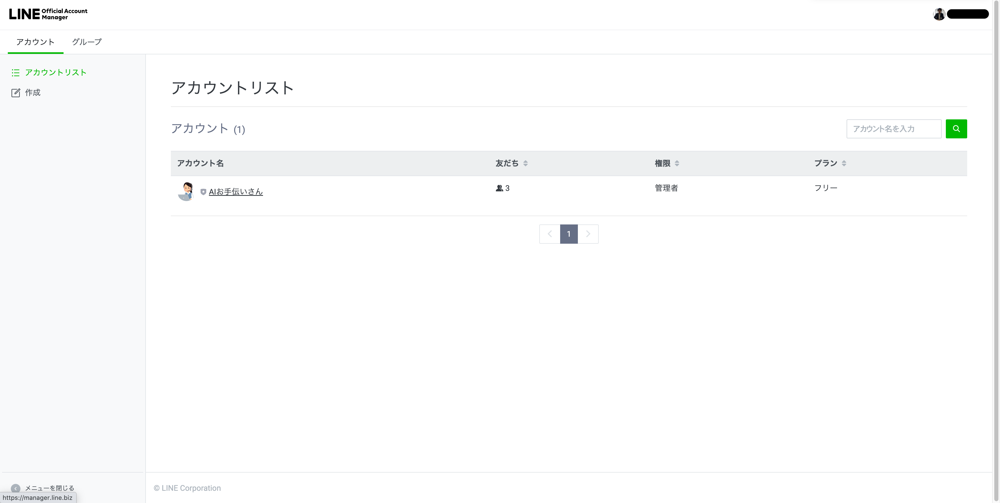

`Messaging API設定` にて AWS の `API Gateway` に紐付いている URL を Webhook URL に設定し、利用を有効にする
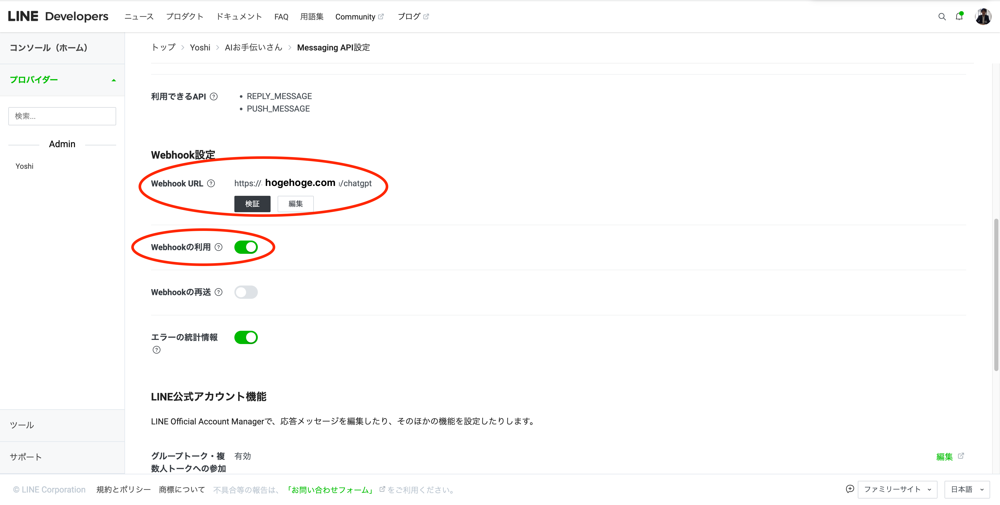

LINE 公式アカウントとのトークでメッセージを送信
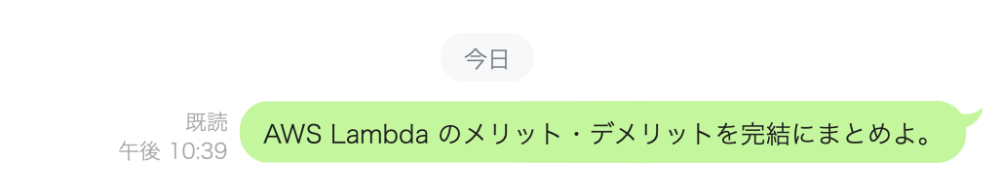

この発言内容が API Gateway 経由で Lambda に連携される

## 3. DynamoDB に会話を保存 + 過去の会話履歴を取得

Lambda で受け取った発言内容をまずは DynamoDB に保存 + 過去の会話履歴を取得する
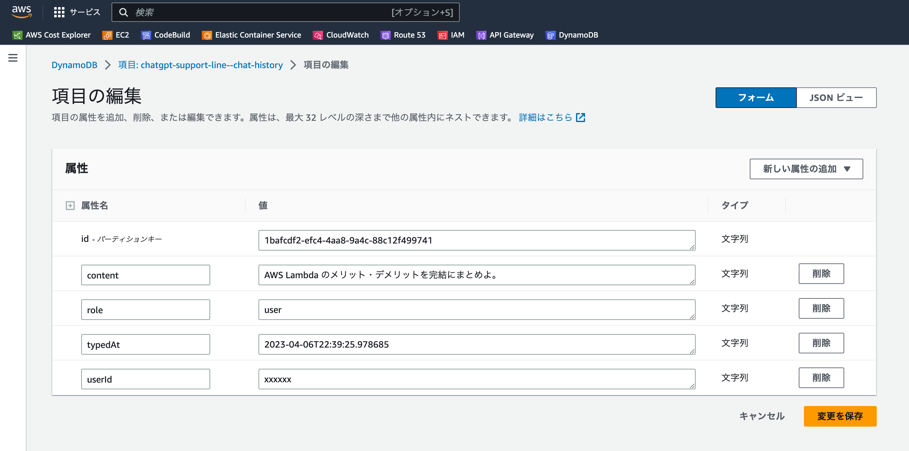
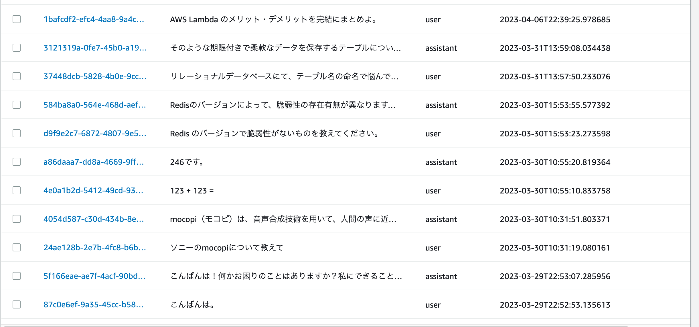

過去の発言を新しい方からいくらか取得する理由は、4.で OpenAI 社の API を叩く際に、AI が会話の文脈を理解できるようにするためです

また、カラムは

- `ID(ランダム文字列)`
- `本文`
- `ロール`
- `発言日時`
- `ユーザーID (LINEユーザーごとの一意の値)`

を設けていますが、一例なので過不足はあるかもしれません  
ロールについては後述します

## 4. OpenAI 社の API と連携 -> 5. DynamoDB に返答を保存

いよいよ OpenAI 社の API を叩きます  
その際必要になるものは主に以下のようなものがあります

- model : モデル。後述
- maxTokens : API から返却される最大のトークン数 (≒ 文字数 (厳密には違う))
- temperature : 高い値だとより複雑な文章を生成できるが不自然になる可能性も含んでいる
- messages : 会話内容
    - role : ロール。後述
    - content : 内容

OpenAI 社では用途に応じて様々なモデルを用意してくれています  
以下が主なモデルです

| base model |      model       | max tokens |                  特徴                   |
|:-----------|:----------------:|-----------:|:-------------------------------------:|
| GPT-3.5    | text-davinci-003 |      4,097 |                 最も高性能                 |
| GPT-3.5    |  gpt-3.5-turbo   |      4,096 | davinci より小規模で高速でコストも davinci の 1/10  |
| GPT-4      |    gpt-4-32k     |     32,768 | どの GPT-3.5 モデルよりも能力が高く、より複雑なタスクを実行できる |
| Codex      | code-davinci-002 |      8,001 |           自然言語をコードに変換するのが得意           |
| Whisper    |    whisper-1     |          - |  音声認識モデルであり、多言語の音声認識、音声翻訳、言語識別を実行できる  |

メッセージには本文の他にロールも渡します。ロールには以下の3つがあります。

- system : AI の設定などを記述
    - ex. 〇〇という設定で会話をします / 口調のサンプルは「〜〜」です など
- assistant : AI の発言
- user : ユーザーの発言

API を叩く際には API key が必要になるので、予め OpenAI 社のコンソールで確認して Lambda に設定しておきましょう

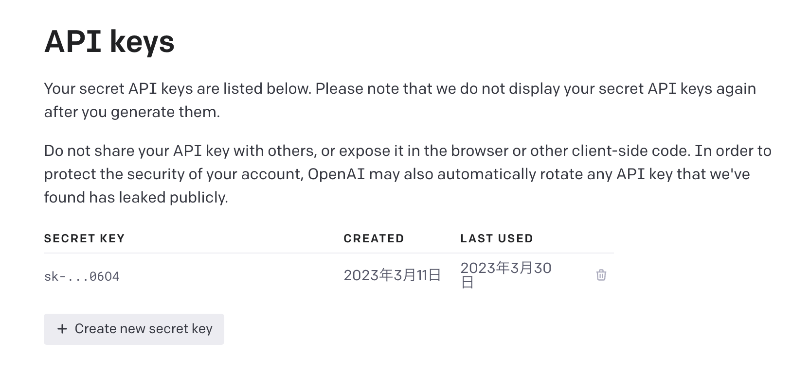

API を叩くとしばらくして返事が返ってくるので、次の発言時に過去の会話を投げられるようにするため、AI からの返答を保存しておきます。

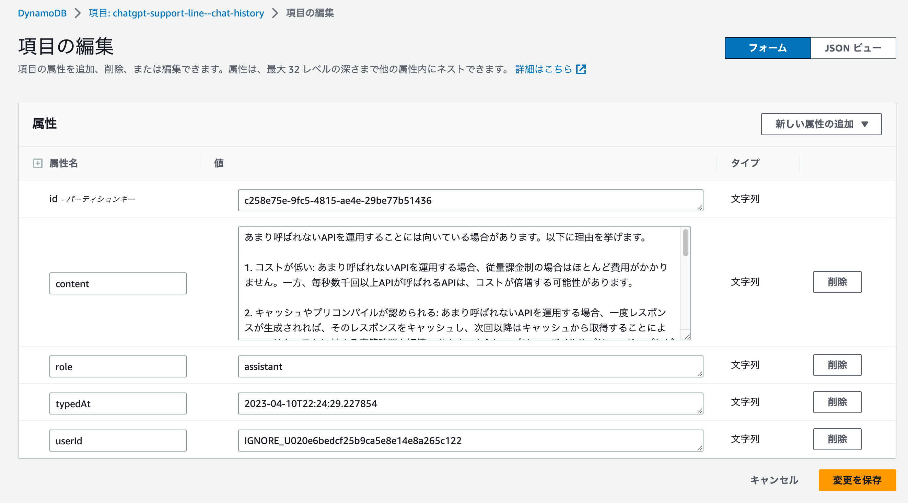

なお、今回用いているのは `gpt-3.5-turbo` で、1,000トークンあたり `0.002ドル`（約0.26円）です。  
普段遣いの軽い会話くらいだと大してコストは掛からないようです。

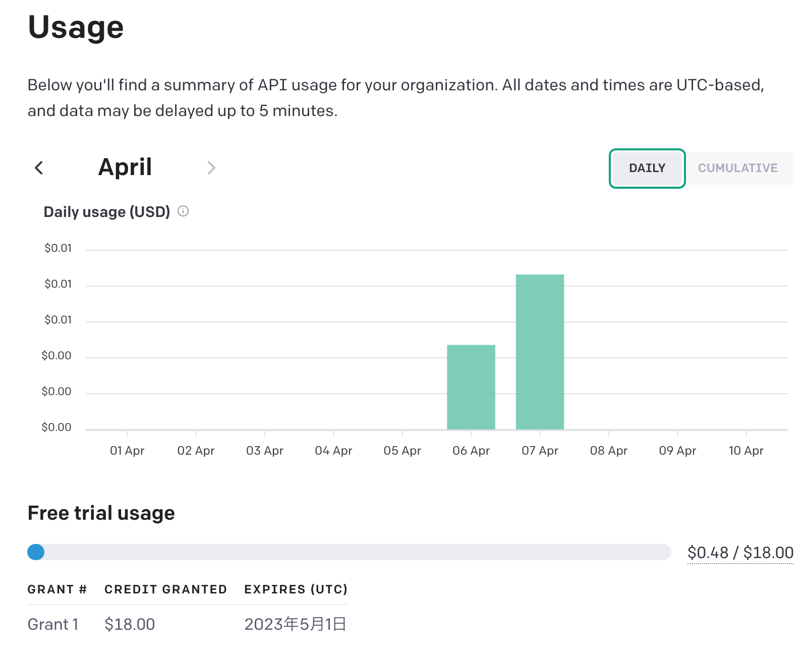

## 6. MessagingAPI の Reply API を叩いて返事を LINE に送信
最後に返事を LINE のトークに返却します。  
使用するのは `MessagingAPI` の `Reply API` です
必要になるのは、まず LINE 公式アカウントのコンソールから確認できる `長期アクセストークン` です

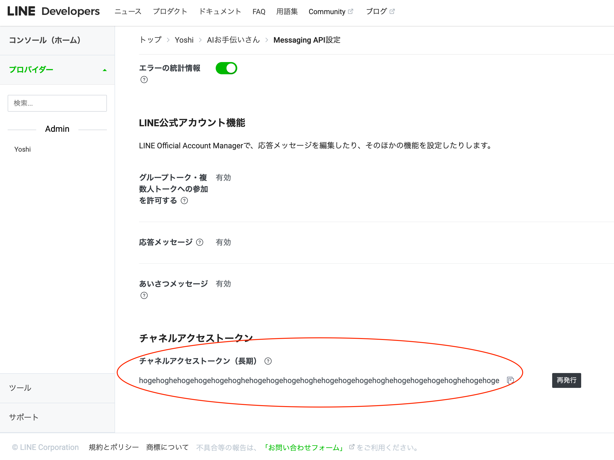

もう一つが、当初メッセージを受け取ったときに一緒に受け取っている `replyToken` です

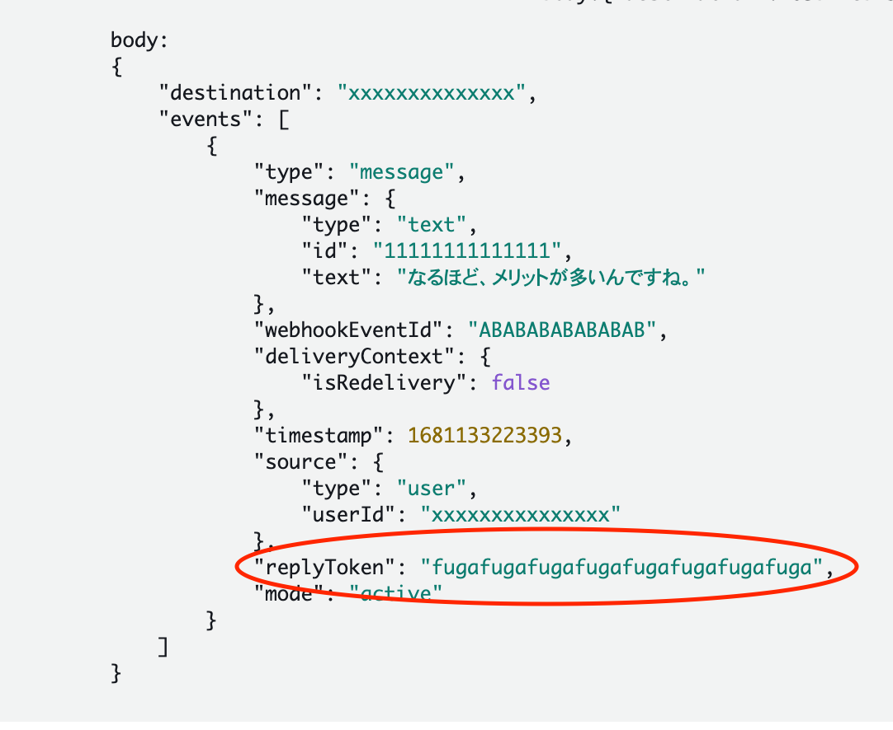

この2つを用いて返信用のエンドポイント( `https://api.line.me/v2/bot/message/reply` )に POSTすると...以下のように LINE にて返事を受け取ることができます

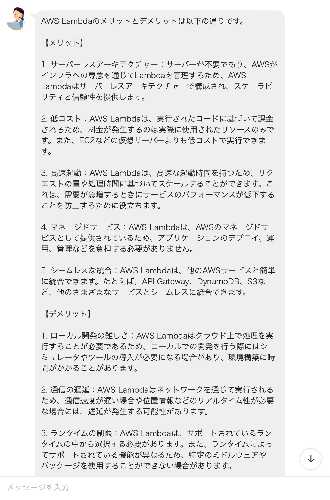

なお、先述のように直近の会話も一緒に投げているので、以下のように会話を続けると細かい説明無しで文脈も把握した上で返事をしてくれます。

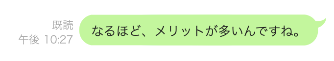

↓ 返事

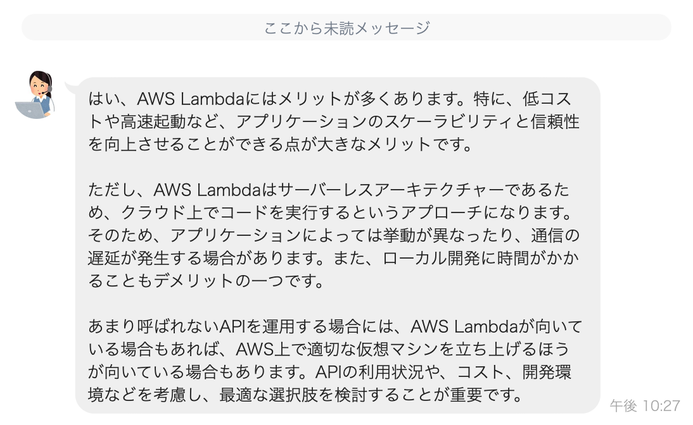

## TODO
- 実装が暫定のかたまり
  - 途中で力尽きたので近々直します
- 過去の会話を投げる部分は max_tokens を数えてから投げないとエラーになって DB 修正をしないと再起不能になる
- グループに公式アカウントを招待しても使えることは確認済だが、グループ内の会話だけを見分ける方法はあるか？
  - グループに所属しているユーザーの ID が判別できればよさそうだが...
  - LINE 公式アカウントにお詳しい方がいらっしゃいましたら教えて下さい。
- 現在 `GPT-4` 申し込み中 (wktk

## DEMO
デモる

