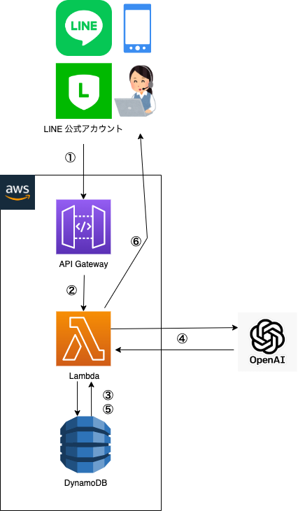

# LINE で OpenAI 社の API と連携するチャットボットを作ってみた (ChatGPT)
## 構成とやりとりの流れ

1. LINE 公式アカウントの `MessagingAPI` を用いて AWS の `API Gateway` に紐付いている URL に Webhook イベントを送信する
2. AWS `Lambda` に連携
3. AWS `DynamoDB` に会話を保存 + 過去の会話履歴を適当な分だけ取得
4. OpenAI 社の API を叩いて返答を得る
5. AWS `DynamoDB` に返答を保存
6. `MessagingAPI` の `Reply API` を叩いて返事を LINE に送信

## 1. MessagingAPI で Webhook イベント送信
xxxxxx (WIP__スクショなど多数)

